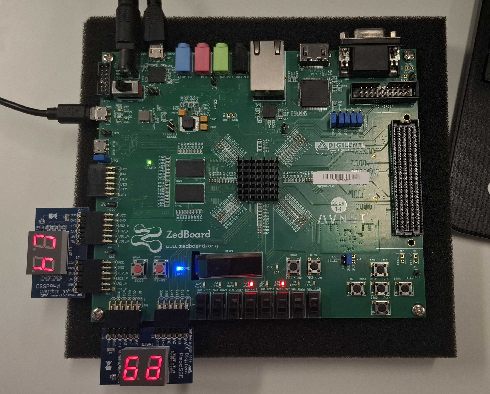

# ECE 340: Embedded Systems

A comprehensive collection of projects on the **Xilinx Zynq-7000 FPGA (Zedboard)** for the ECE340-Embedded Systems cource at the University of Thessaly from my 3rd year

---

## 1️⃣ Lab 1: FPGA Design of a Floating Point Unit (FPU)

**Duration:** 3 Weeks | **Focus:** RTL Design, Simulation & FPGA Implementation

### 🎯 Overview

Implementation of a single-precision **Floating Point Adder (FPA)** compliant with the **IEEE 754** standard. The project evolved from a single-cycle behavioral model to a fully implemented system on the Zedboard with real-time I/O handling.

### 📂 Detailed Steps

* **Step 1 & 2: Architecture & Pipelining**
    * Designed a single-cycle FPA logic (Normalization, Leading Zero Counting).
    * Optimized performance by extending the design into a **2-stage pipeline** to improve clock frequency.
* **Step 3 & 4: Hardware Integration**
    * **Display Logic:** Implemented a `SevenSegDisplay` module with time-multiplexing (320ns) to drive 7-segment displays via PMOD.
    * **Memory & Control:** Integrated a `DataMemory` unit to store multiple 32-bit input pairs (A & B). Developed logic to cycle through these test cases using physical buttons, enabling real-time verification of the FPU.
    * **Signal Conditioning:** Implemented a **Digital Debouncer** to ensure signal stabilityand an **Edge Detector** to accurately trigger data transitions, filtering out mechanical switch noise.

### 🛠️ Toolstack
| Category | Tool |
| :--- | :--- |
| **FPGA Board** | Xilinx Zedboard (Zynq-7000) |
| **Development** | Xilinx Vivado 2020.2 |
| **Language** | Verilog HDL |

---

## 2️⃣ Lab 2: Processor-Based SoC Design & SW Development

**Duration:** 2 Weeks | **Focus:** ARM Cortex-A9 Integration, Interrupts & Custom IP (PS-PL)

### 🎯 Overview

Development of a complete **System-on-Chip (SoC)** by interfacing the ARM processor (PS) with the FPGA fabric (PL). The project utilized a **Cross-Development** workflow, where software was developed and compiled on a host PC (Vitis IDE) and deployed to the target ARM Cortex-A9 processor for real-time execution and profiling.

### 📂 Detailed Steps

#### Step 1: PS-PL Communication & Interrupt Management
* **1a. Basic Interface:** Built a hardware platform with an ARM CPU, UART, and GPIOs. Developed software to read physical switches and buttons from the PL and output their status to the serial console (Minicom), verifying the link between software and hardware.
* **1b. Interrupt Handling:** Replaced the polling mechanism with an **Interrupt-Driven** approach. Configured the **Generic Interrupt Controller (GIC)** to detect button presses as asynchronous events, triggering specialized Interrupt Service Routines (ISRs) to update a counter.

#### Step 2: Application Profiling & Code Optimization
* **Performance Benchmarking:** Implemented a high-precision timer utility using the **ARM Private Timer** to profile two distinct workload types.
* **Workload Analysis:** 
    * **Matrix Multiplication (Memory-Bound):** Used to stress-test the cache subsystem. larger sizes (e.g., 1024x1024) highlight performance drops due to high **cache miss** rates and memory latency.
    * **Pi Calculation (CPU-Bound):** Focused on pure arithmetic throughput (Leibniz series) with minimal memory footprint to evaluate raw ALU performance.
* **Optimization:** Evaluated compiler flags (**None, O2, O3**) across various problem sizes. Results are documented in `lab2/step2/runs.txt`, demonstrating the impact of compiler-level optimizations on cycle efficiency.

#### Step 3: Custom IP Integration (Lab 1 FPU)
* **Custom IP** Converted the Floating Point Adder from Lab 1 into a standalone **AXI4-Lite Peripheral**. 
* **Address Mapping:** Integrated the IP into the SoC's memory map, allowing the ARM CPU to write operands ($A, B$) and control signals directly to the hardware registers.
* **System Integration:** Verified the full path: ARM CPU triggers the FPU $\rightarrow$ Hardware calculates result $\rightarrow$ Output is displayed on Zedboard's **LEDs** and **7-Segment displays**.

<table align="center">
  <tr>
    <td align="center"><b> A Representative Photo</b></td>
  </tr>
  <tr>
    <td></td>
  </tr>
</table>

The software developed in Vitis for each step, has been hosted in a different workspace:

| Step | Vitis Workspace |
| :--- | :--- |
| `lab2/step1a` | **`workspace/`** | 
| `lab2/step1b` | **`workspace2/lab2_interrupt_arm`** |
| `lab2/step2` | **`workspace_step2/step2_arm`** | 
| `lab2/step3` | **`workspace_step3/lab2_fpadd_platform`** |

### 🛠️ Toolstack
| Category | Tool |
| :--- | :--- |
| **Architecture** | Zynq-7000 SoC (Dual-core ARM Cortex-A9) |
| **Hardware Design** | Xilinx Vivado 2020.2 |
| **Software Dev** | Xilinx Vitis IDE |

---

## 3️⃣ Lab 3:  FPGAs as Accelerators

**Duration:** 7 Weeks | **Focus:** High-Level Synthesis (HLS), OpenCL, Pararell Array Architectures, Memory Hierarchy Optimization

### 🎯 Overview
An end-to-end acceleration of a Sequence Alignment algorithm (Local Sequence Alignment - Smith-Waterman variant) on a Xilinx Adaptive SoC. The project focuses on transforming a standard sequence alignment loop into a massively parallel hardware accelerator using **Xilinx Vitis High-Level Synthesis (HLS)** and managing the system execution via an **OpenCL Host Application** running on the ARM CPU. 

The core computation is accelerated by converting a data-dependent dynamic programming matrix into a **parallel Array-like pipeline**, processing alignment cells along anti-diagonals to achieve an Ideal Initiation Interval ($II=1$).

### 📂 Repository Structure & Project Steps

The source code for this lab is organized into specialized directories tracking the design exploration and scaling process:

* **`sw_x86_codes/`:** Initial algorithmic evaluation on x86/ARM CPU. Includes different software optimization steps (`lsal.cpp`, `lsal_plus1.cpp`,  `lsal_outside.cpp`) to model memory layouts and bounds check reductions before moving to hardware.
* **`hardware_codes/`:** Hardware/Software Co-Design implementations for the baseline dataset ($N=32$ query size, $M=65536$ database size).
    * Includes incremental architecture steps (`serial`, `diag_first`, `diag_second`, `diag_third`) exploring pipeline scheduling.
    * **`final/`:** The final optimized hardware setup. It features 512-bit wide AXI Master interfaces, vector bit-packing (packing 170 3-bit characters per 512-bit DRAM block), an on-the-fly streaming window data-loader, a **complete parallel pipeline ($II=1$)**, and an **HW Binary Reduction Tree** to find the maximum alignment score case without stalls.
* **`bigger_inputs/`:** Scaled up versions of the accelerated kernel to benchmark memory bandwidth and hardware resources. Contains standalone folders configuring the Host and Kernel for larger global matrices:
    * `inputs_32_100000 / inputs_32_120000 / inputs_32_125000` (Query: 32, Database up to 125K)
    * `inputs_64_65536 / inputs_64_125000` (Scaled Query size to 64 elements)

<pre>
. (Lab 3 Root Directory)
├── assignment.pdf
├── Lab3_PowerPoint.pptx
├── Lab3_Report.pdf
├── sw_x86_codes/
│   ├── lsal.cpp
│   ├── lsal_outside.cpp
│   └── lsal_plus1.cpp
├── hardware_codes/
│   ├── serial/
│   ├── diag_first/
│   ├── diag_second/
│   ├── diag_third/
│   └── final/
│       ├── lsal.cpp
│       └── lsal_host.cpp
└── bigger_inputs/
    ├── inputs_32_100000/
    ├── inputs_32_120000/
    ├── inputs_32_125000/
    ├── inputs_64_65536/
    └── inputs_64_125000/
</pre>

### 📈 Documentation
The complete analysis, benchmarking results, hardware resource utilization (BRAM, DSP, FF, LUT), and design tradeoffs can be found in the root of the lab folder:
* 📄 **[`assignment.pdf`](./assignment.pdf):** The official project specifications.
* 📄 **[`Lab3_Report.pdf`](./Lab3_Report.pdf):** The final technical report containing execution time comparisons between CPU vs FPGA.
* 📊 **[`Lab3_PowerPoint.pptx`](./Lab3_PowerPoint.pptx):** Project presentation slides.

### 🛠️ Toolstack
| Category | Tool |
| :--- | :--- |
| **HW Synthesis** | Xilinx Vitis HLS 2020.2 / Vivado Design Suite |
| **Runtime Flow** | OpenCL API / Xilinx Runtime (XRT) |
| **Language** | C++ |

---
